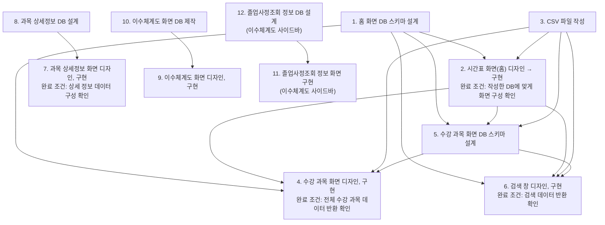

# 5주차 활동지 / Week 5 Worksheet

**1-page 기획서 / One-page plan**

- 작성일 / Date: 2026-09-30
- 참여자 / Present: 김준석, 김명준, 정찬영

---

## ① 주제 확정 / Confirm topic

- 확정 주제 / Topic: 한 화면에서 수강 편람, 강의평, 이수 체계도와 같은 정보를 한번에 볼 수 있는 프로그램
- 이유 / Reason: 실제 수강 신청을 하면서 불편함을 느꼈던 부분이기 때문에 선정했다.

---

## ② 태스크 분해와 의존 관계 / Tasks and dependencies

### 태스크 목록 / Task list

4주차 사용자 스토리와 완료 조건을 태스크로 나눕니다.
*Break down your Week 4 user stories and acceptance criteria into tasks.*

각 태스크는 따로 끝내도 맞는지 확인할 수 있어야 합니다. 담당에 '다 같이'는 쓰지 않습니다.
*Each task must be checkable on its own. Do not write "everyone" as owner.*

| # | 태스크 Task | 완료 조건 Done when | 선행 태스크 Depends on | 담당 Owner |
|---|---|---|---|---|
| 1 | 홈 화면에 대한DB 스키마 설계 | x |  |  |
| 2 | 시간표 화면(홈 화면) 디자인 -> 구현 | 작성한 DB에 맞게 화면이 구성되는지 확인 | 1,3 |  |
| 3 | CSV파일 작성 | x |  |  |
| 4 | 수강 과목에 대한 화면 디자인, 구현(2번째) | 수강 과목(전체)에 대한 데이터가 잘 반환되는지 확인  | 1,2,3,5 |  |
| 5 | 수강 과목에 대한 화면 DB 스키마 설계 |  | 1,2,3 |  |
| 6 | 검색 창 디자인, 구현 | 검색한 데이터가 잘 반환되는지 확인 | 1,2,3,5 |  |
| 7 | 수강과목 클릭했을때 과목 상세정보 반환 화면 디자인, 구현| 과목 상세 정보의 데이터가 잘 구성되는지 확인 | 8 |  |
| 8 | 과목 상세정보 DB설계 |  |  |  |
| 9 | 이수체계도 화면(3번째) 디자인, 구현 |  | 10 |  |
| 10 | 이수체계도 화면에 대한 DB 제작 |  |  |  |
| 11 | 이수체계도 화면 사이드바에 졸업사정조회 정보 화면 구현 |  | 11 |  |
| 12 | 이수체계도 화면 사이드바에 졸업사정조회 정보 DB 설계 |  |  |  |
### 의존 관계 그래프 / Dependency graph (DAG)

화살표는 "앞 태스크가 끝나야 뒤 태스크를 할 수 있다"는 뜻입니다.
*An arrow means the first task must finish before the second can start.*

**그리는 방법 / How to draw**
- 아래 예시에서 상자 이름을 바꾸고, 선후 관계 하나마다 화살표(`-->`) 줄을 하나씩 추가합니다. GitHub에서 파일을 열면 그림으로 보입니다. 미리 보려면 mermaid.live에 붙여 넣으세요.
  *Rename the boxes and add one `-->` line per dependency. GitHub shows it as a diagram. Preview at mermaid.live.*
- 태스크 표를 AI에게 주고 "Mermaid 그래프로 바꿔 줘"라고 요청해도 됩니다.
  *You can also give the task table to AI and ask "Convert this into a Mermaid graph."*
- 어려우면 종이에 그려 사진을 `docs/images/`에 올리고 ``로 넣어도 됩니다.
  *Or draw it on paper, upload the photo to `docs/images/` and link it with ``.*


graph LR
  # 프로젝트 태스크 의존성



## 태스크 표

| # | 태스크 | 완료 조건 | 선행 태스크 | 담당 |
|---|---|---|---|---|
| 1 | 홈 화면 DB 스키마 설계 | - | - | |
| 2 | 시간표 화면(홈) 디자인 → 구현 | 작성한 DB에 맞게 화면 구성 확인 | 1, 3 | |
| 3 | CSV 파일 작성 | - | - | |
| 4 | 수강 과목 화면 디자인, 구현 | 전체 수강 과목 데이터 반환 확인 | 1, 2, 3, 5 | |
| 5 | 수강 과목 화면 DB 스키마 설계 | - | 1, 2, 3 | |
| 6 | 검색 창 디자인, 구현 | 검색 데이터 반환 확인 | 1, 2, 3, 5 | |
| 7 | 과목 상세정보 화면 디자인, 구현 | 상세 정보 데이터 구성 확인 | 8 | |
| 8 | 과목 상세정보 DB 설계 | - | - | |
| 9 | 이수체계도 화면 디자인, 구현 | - | 10 | |
| 10 | 이수체계도 화면 DB 제작 | - | - | |
| 11 | 졸업사정조회 정보 화면 구현 | - | 12 | |
| 12 | 졸업사정조회 정보 DB 설계 | - | - | |
```

- 지금 착수 가능 (진입 차수 0) / Can start now (in-degree 0): 
- 작업 순서 (위상정렬) / Work order (topological sort): 
- 사이클이 있었다면 어떻게 풀었는가 / If there was a cycle, how did you fix it?: 

---

## ③ 범위 결정 / Scope

### Must — 없으면 성립 안 됨 / essential

핵심 시나리오 1개가 끝까지 동작하는 데 필요한 것만 / *Only what the core scenario needs to work end-to-end*

- 핵심 시나리오 / Core scenario: 수강정보 (검색 화면), 내 시간표(홈 화면), 커리큘럼(이수 체계도 화면) 구현
- 개인시간표 구성 (시간표에 강의 등록 가능한지, 중복 강의, 시간 겹치는 강의 등에서 오류 메시지를 반환하는지)
- 강의명 전체 또는 일부를 입력하면 선택 가능한 강의 반환
- 


### Should (없을 경우에는 작성하지 마세요)
 
 - 시나리오


### Could (없을 경우에는 작성하지 마세요)

 - #11,#12

### **Won't — 이번 학기에 안 함 / not this semester**

| Won't 항목 Item | 포기한 이유 Why |
|---|---|
| 로그인 기능 | 자체 데이터 제작하여 사용, 기간이 길었다면, 로그인 구현 했을 것 |
| 학과 1개로 제한 | 직접 데이터를 입력해야 하기 때문에 1개 학과로 범위 제한  |

### 실행 가능성 확인 / Feasibility check

- 특수 장비·유료 API·실제 개인정보가 필요한가? 필요하다면 대안은?
  *Does it need special hardware, paid APIs or real personal data? If so, what is the alternative?*
- 15주차에 발표장에서 시연할 수 있는 형태인가?
  *Can it be demonstrated live in Week 15?*

---

## ④ 가장 먼저 동작시킬 흐름 (Walking Skeleton) / First end-to-end flow

예 / Example: 과제 ID를 입력하면 → LMS에서 제출 기록을 받아 와서 → 화면에 제출 인원 숫자 하나가 뜬다

> [무엇을 입력하면] → [무엇을 처리해서] → [화면에 무엇이 나온다]
> 

---

> 수업 종료 시 커밋하세요 / Commit this at the end of class
> `git add docs/week-05.md && git commit -m "docs: 5주차 활동지 작성"`
